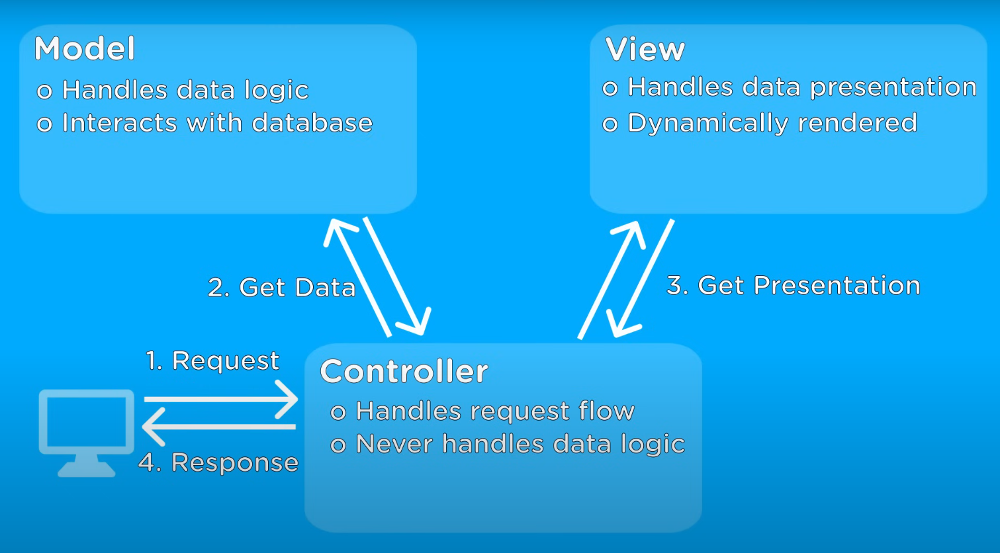

# Addison Liquors App
- A stateful application to store USER information for Parking Reservations across the Cubs Season and other Wrigley Field Events. Standalone VM not production ready.

## Google Compute Engine Free Tier
|Title|Description|
|---------------|-----------|
|Compute Engine	| 1 non-preemptible e2-micro VM instance per month in one of the following US regions: Oregon: us-west1, <b>Iowa: us-central1</b>, South Carolina: us-east1, 30 GB-months standard persistent disk, 1 GB of outbound data transfer from North America to all region destinations (excluding China and Australia) per month Your Free Tier e2-micro instance limit is by time, not by instance. Each month, eligible use of all of your e2-micro instances is free until you have used a number of hours equal to the total hours in the current month. Usage calculations are combined across the supported regions. Compute Engine free tier does not charge for an external IP address. GPUs and TPUs are not included in the Free Tier offer. You are always charged for GPUs and TPUs that you add to VM instances. [GCS Free Tier](https://cloud.google.com/free/docs/free-cloud-features?utm_source=google&utm_medium=email&utm_content=OrigamiC2e&utm_campaign=OrigamiC2#free-tier-usage-limits)|
|G-Cloud CLI    |[CLI Install](https://cloud.google.com/sdk/docs/install)|
||

## Dependencies:
- For dotenv , use config() not parse() or load()

## Backend
### REST
- Basically getting, creating, updating, and deleting data.
- <b>Re</b>presentation State Transfer
- REST uses the 4 basic HTTP transactions : PUT, POST, GET, DELETE
1. GET
    - Gets Data, if there is no ID it will retrieve all of the data you are acting upon.
2. POST
    - Corresponds with creation, should be used on the entire resource.
3. PUT
    - Corresponse with updating a resource.
4. DELETE
    - Deletes data with given ID.
## MVC
- Model View Controller
- Responsible for handing request from client.

## YouTube Video:
| Title                                            | Description                                                       |
| ------------------------------------------------ | ----------------------------------------------------------------- |
| [Full Stack App Tutorial](https://www.youtube.com/watch?v=6sUbt-Qp6Pg&list=PLZlA0Gpn_vH8jbFkBjOuFjhxANC63OmXM&index=3) | This is video 3 of a bunch so use this to access whole playlist                       |
https://www.npmjs.com/package/mongoose

## Dependencies
| Title                                                  | Description                                                 |
|--------------------------------------------------------|-------------------------------------------------------------|
| [Mongoose](https://www.npmjs.com/package/mongoose)     | Database software                                           |
| [ejs](https://www.npmjs.com/package/mongoose)          | Templating Engine                                           |
| [express-ejs-layouts]()                                | Database software                                           |
| [express]()     | Database software                                           |
7

## Dev Dependencies
| Title                                                  | Description                                                 |
|--------------------------------------------------------|-------------------------------------------------------------|
| [nodemon]()                                            | Automatically updates server after updating files           |